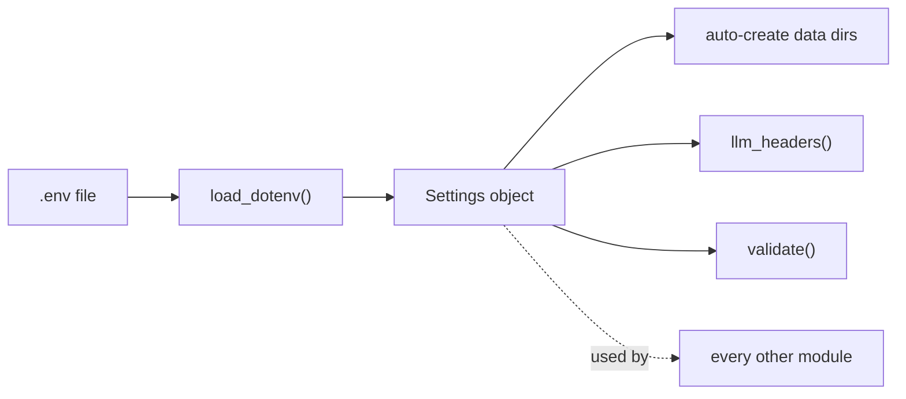

# config/ — Configuration

Loads every setting from the .env file into a single Settings object, creates the runtime data directories, and builds the HTTP headers used for the LLM backend (OpenRouter or Ollama).

## Files

| File | Responsibility |
|------|----------------|
| `__init__.py` | Marks the package. |
| `settings.py` | Reads .env with python-dotenv, exposes typed settings with defaults, auto-creates data dirs, and provides llm_headers() and validate(). |

## Flow



## Example

```python
from config.settings import settings

print(settings.LLM_MODEL)          # e.g. "openrouter/auto"
headers = settings.llm_headers()   # Authorization + optional OpenRouter headers
missing = settings.validate()      # list of required settings that are unset
```

---
_Part of [LocalMind](../README.md). See [docs/architecture.html](architecture.html) for the full interactive architecture and sequence diagrams._
