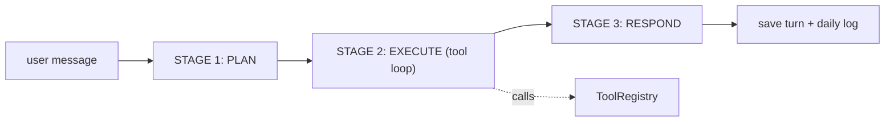

# engine/ — LLM-First Router

The brain. Router runs the three-stage Plan -> Execute -> Respond loop for every message. The model plans, calls tools in a loop, then writes the final answer. There is no intent classifier — the LLM decides everything.

## Files

| File | Responsibility |
|------|----------------|
| `__init__.py` | Marks the package. |
| `router.py` | Router: _plan(), _execute() (agentic tool loop up to 15 iterations), _respond(); persists each turn. |
| `_chat()` | Shared pooled HTTP call to the LLM with retry/backoff (tenacity). |

## Flow



## Example

```python
router = Router(memory, rag, mcp_coordinator, skill_executor)
reply = await router.process(user_id, user_name, "summarize my notes")
```

---
_Part of [LocalMind](../README.md). See [docs/architecture.html](architecture.html) for the full interactive architecture and sequence diagrams._
