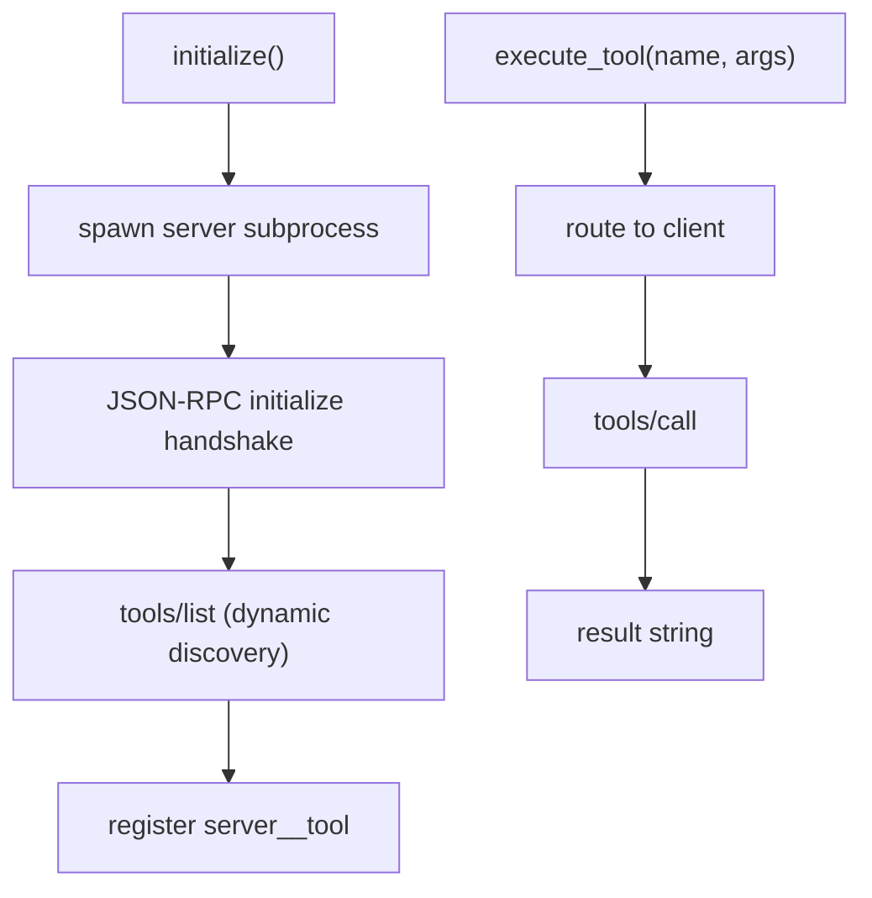

# mcp/ — MCP Tool Integration

Connects to external MCP servers (Telegram, GitHub, Filesystem, Windows, LinkedIn). Each server is spawned as a subprocess; tools are discovered dynamically over JSON-RPC and namespaced as server__tool.

## Files

| File | Responsibility |
|------|----------------|
| `__init__.py` | Marks the package. |
| `coordinator.py` | MCPCoordinator: starts enabled servers, discovers tools, and routes execute_tool() to the right client. |
| `client.py` | MCPClient: JSON-RPC 2.0 over stdio with a threaded reader; initialize handshake, tools/list, tools/call. |
| `SETUP.md / mcp_config_reference.json` | Setup notes and a reference config for external MCP clients. |

## Flow



## Example

```python
coord = MCPCoordinator()
await coord.initialize()                     # spawn servers + discover tools
out = await coord.execute_tool("github__create_issue", {"title": "Bug"})
```

---
_Part of [LocalMind](../README.md). See [docs/architecture.html](architecture.html) for the full interactive architecture and sequence diagrams._
