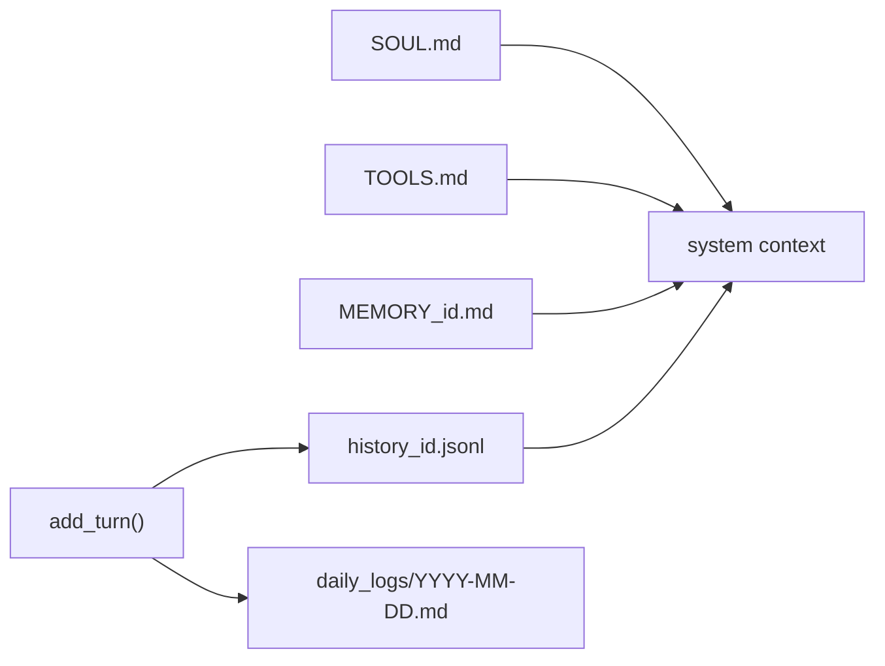

# memory_store/ — Layered Memory

Persists who the bot is and what it knows. Global persona (SOUL.md, TOOLS.md), per-user preferences and curated facts, full conversation history (JSONL), and a human-readable daily log.

## Files

| File | Responsibility |
|------|----------------|
| `__init__.py` | Marks the package. |
| `memory.py` | MemoryStore: get_soul(), get/save facts and prefs, get_history(), add_turn() with JSONL persistence, clear_history(). |

## Flow



## Example

```python
soul = await memory.get_soul()
await memory.save_memory_fact(user_id, "prefers concise answers")
await memory.add_turn(user_id, "hi", "hello!")
```

---
_Part of [LocalMind](../README.md). See [docs/architecture.html](architecture.html) for the full interactive architecture and sequence diagrams._
