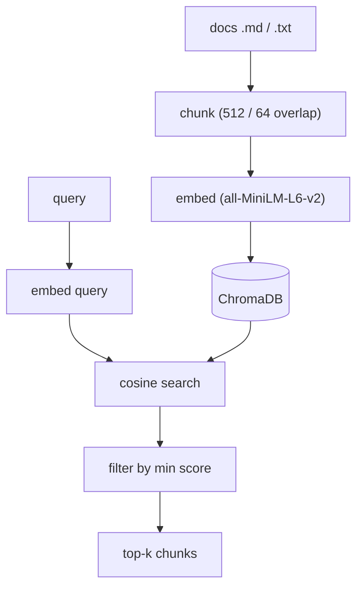

# rag/ — RAG Knowledge Base

Semantic search over your documents. Files are chunked, embedded with sentence-transformers, and stored in ChromaDB; a query is embedded and matched by cosine similarity, filtered by a score threshold.

## Files

| File | Responsibility |
|------|----------------|
| `__init__.py` | Marks the package. |
| `retriever.py` | RAGRetriever: initialize() (ChromaDB + embedder), index_text/file/memory_files(), retrieve(), get_stats(), clear(). |

## Flow



## Example

```python
rag = RAGRetriever(persist_dir="./data/chroma_db")
await rag.initialize()
await rag.index_memory_files("./data/memory")
hits = await rag.retrieve("what did we decide about pricing?")
```

---
_Part of [LocalMind](../README.md). See [docs/architecture.html](architecture.html) for the full interactive architecture and sequence diagrams._
