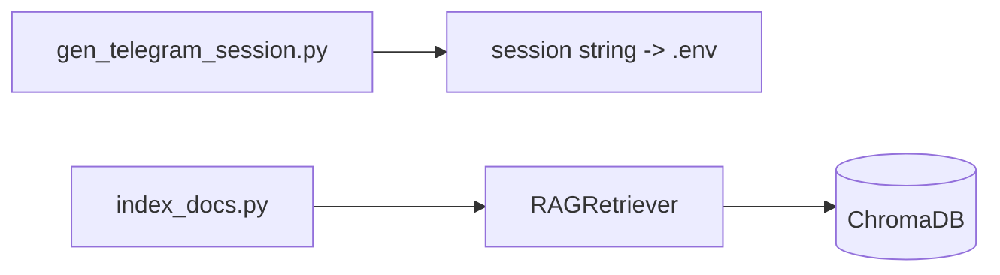

# scripts/ — Utilities

One-off command-line helpers used during setup and maintenance.

## Files

| File | Responsibility |
|------|----------------|
| `gen_telegram_session.py` | Interactive generator for TELEGRAM_SESSION_STRING (Telethon). |
| `index_docs.py` | Manual RAG indexer: --file, --dir, --stats, --clear. |

## Flow



## Example

```python
python scripts/gen_telegram_session.py         # prints a session string for .env
python scripts/index_docs.py --dir ./data/memory
python scripts/index_docs.py --stats
```

---
_Part of [LocalMind](../README.md). See [docs/architecture.html](architecture.html) for the full interactive architecture and sequence diagrams._
