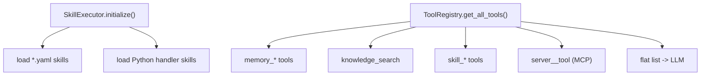

# skills/ — Capabilities & Tool Registry

Turns everything the model can do into one flat tool list. ToolRegistry merges memory tools, RAG search, skills, and MCP tools; SkillExecutor loads YAML prompt skills and optional Python handler skills and runs them.

## Files

| File | Responsibility |
|------|----------------|
| `__init__.py` | Marks the package. |
| `tool_registry.py` | ToolRegistry.get_all_tools() builds the flat list; execute() dispatches each call to memory / RAG / skills / MCP. |
| `executor.py` | SkillExecutor loads *.yaml prompt skills and subfolder Python skills, and runs them. |
| `*.yaml` | Default prompt skills: summarize, scan_bugs, draft_message, github_workflow, telegram_manage, file_manager. |

## Flow



## Example

```python
tools = await tool_registry.get_all_tools()   # memory + RAG + skills + MCP
result = await tool_registry.execute("knowledge_search", {"query": "budget"}, user_id, router)
```

---
_Part of [LocalMind](../README.md). See [docs/architecture.html](architecture.html) for the full interactive architecture and sequence diagrams._
