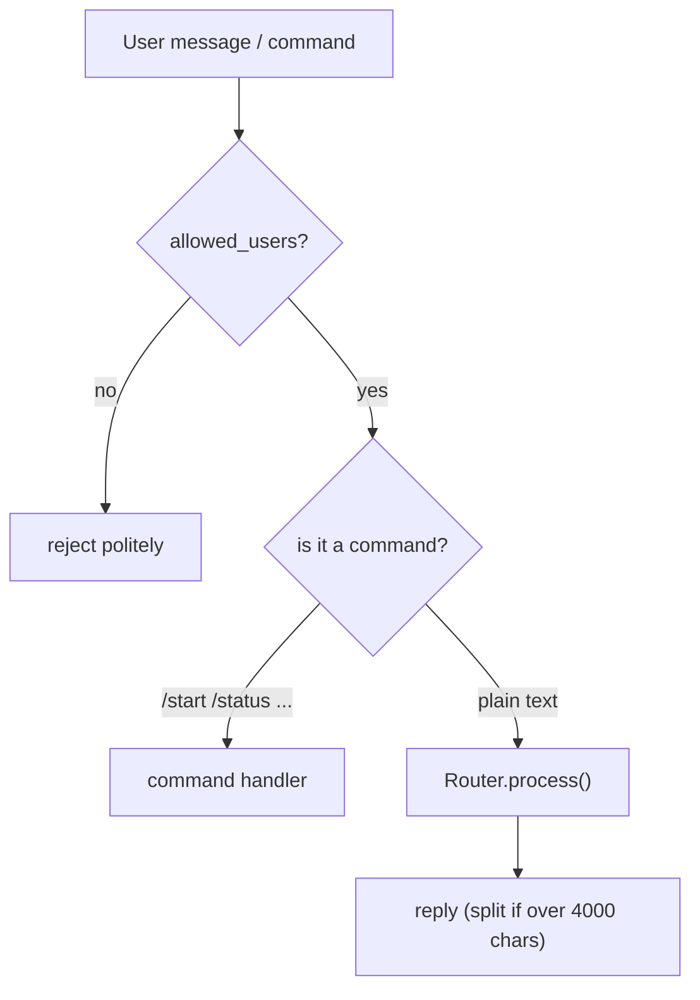

# telegram_handler/ — Telegram Interface

The user-facing layer. It runs the Telegram bot, enforces the allowed-users security gate, handles slash commands, and forwards plain messages to the Engine.

## Files

| File | Responsibility |
|------|----------------|
| `__init__.py` | Marks the package. |
| `handler.py` | TelegramHandler: builds the bot Application, registers commands (/start, /help, /memory, /skills, /clear, /status, /index), initializes MCP in post_init, and dispatches text to Router.process(). |

## Flow



## Example

```python
handler = TelegramHandler(
    token=settings.TELEGRAM_BOT_TOKEN,
    allowed_users=settings.TELEGRAM_ALLOWED_USERS,
    router=router,
)
handler.run()   # starts long-polling
```

---
_Part of [LocalMind](../README.md). See [docs/architecture.html](architecture.html) for the full interactive architecture and sequence diagrams._
