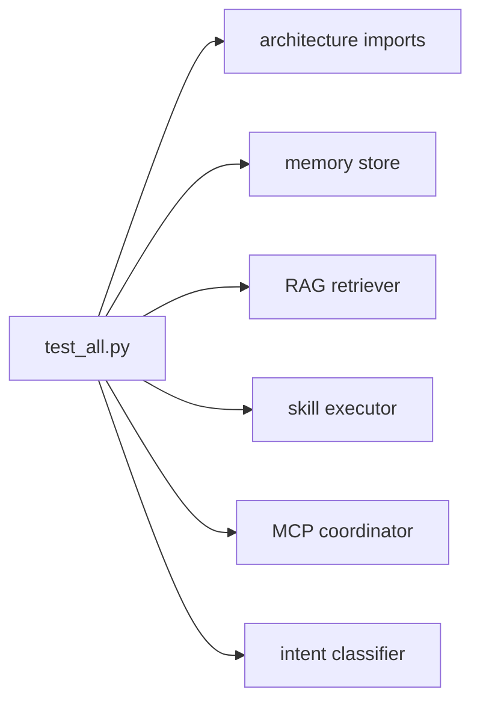

# tests/ — Test Suite

A single component test suite that verifies imports and each subsystem in isolation using dummy env values, so it runs without real credentials.

## Files

| File | Responsibility |
|------|----------------|
| `__init__.py` | Marks the package. |
| `test_all.py` | Tests: architecture imports, intent classifier, memory store, RAG retriever, skill executor, MCP coordinator. |

## Flow



## Example

```python
python tests/test_all.py
# -> 6/6 tests passed
```

---
_Part of [LocalMind](../README.md). See [docs/architecture.html](architecture.html) for the full interactive architecture and sequence diagrams._
